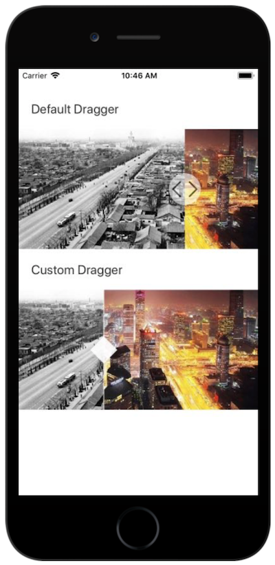

# Before-After comparison slider for react-native applications

This is a comparison slider component to compare two images, components and etc.

[Open project in the browser](https://expo.io/@malik-aliyev-94/before-after-slider)


## Installation

```bash
npm i @malik.aliyev.94/react-native-before-after-slider
```

## API

## API

| Property            | Optional | Default      | Description                                |
| ------------------- | -------- | ------------ | ------------------------------------------ |
| width               | yes      | screen width | width of the slider                        |
| height              | yes      | width/2      | height of the slider                       |
| draggerWidth        | yes      | 50           | width of the dragger component             |
| initial             | yes      | 0            | initial position of the dragger            |
| onMoveStart         | yes      | empty        | function to call on dragger move start     |
| onMove              | yes      | empty        | function to call on dragger move           |
| onMoveEnd           | yes      | empty        | function to call on dragger move end       |

## Examples



You can see usage examples with a default dragger and custom dragger below.

```javascript
import React, { Component } from 'react';
import { Text, StyleSheet, View, Dimensions, Image, Platform, ScrollView } from 'react-native';
import Compare, { Before, After, DefaultDragger, Dragger } from '@malik.aliyev.94/react-native-before-after-slider';

const deviceWidth = Dimensions.get("window").width;
const deviceHeight = Dimensions.get("window").height;

export default class App extends Component {

  constructor(props) {
    super(props);
    this.state = {
      scrollEnabled: true,
    }
  }

  onMoveStart() {
    this.setState({scrollEnabled: false});
  }

  onMoveEnd() {
    this.setState({scrollEnabled: true});
  }

  render() {
    return (
      <ScrollView style={{marginTop: 50}} scrollEnabled={this.state.scrollEnabled}>

        <Text style={{marginBottom: 20, color: '#333', paddingLeft: 20, fontSize: 20}}>Default Dragger</Text>
        <Compare initial={deviceWidth/2} draggerWidth={50} onMoveStart={this.onMoveStart.bind(this)} onMoveEnd={this.onMoveEnd.bind(this)}>
          <Before>
            <Image source={require('./src/images/before.png')} style={{width: deviceWidth, height: deviceWidth/2}} />
          </Before>
          <After>
            <Image source={require('./src/images/after.png')} style={{width: deviceWidth, height: deviceWidth/2}} />
          </After>
          <DefaultDragger />
        </Compare>

        <Text style={{marginBottom: 20, marginTop: 20, color: '#333', paddingLeft: 20, fontSize: 20}}>Custom Dragger</Text>
        <Compare initial={deviceWidth/2} draggerWidth={50} >
          <Before>
            <Image source={require('./src/images/before.png')} style={{width: deviceWidth, height: deviceWidth/2}} />
          </Before>
          <After>
            <Image source={require('./src/images/after.png')} style={{width: deviceWidth, height: deviceWidth/2}} />
          </After>
          <Dragger>
            <View style={{position: 'absolute', top: 0, right: 24, bottom: 0, left: 24, backgroundColor: '#fff', opacity: .6}}></View>
            <View style={{position: 'absolute', top: deviceWidth/4, left: 10, backgroundColor: '#fff', opacity: .9, width: 30, height: 30, marginTop: -15, transform: [{ rotate: '45deg'}]}}></View>
          </Dragger>
        </Compare>

      </ScrollView>
    );
  }
}

```
